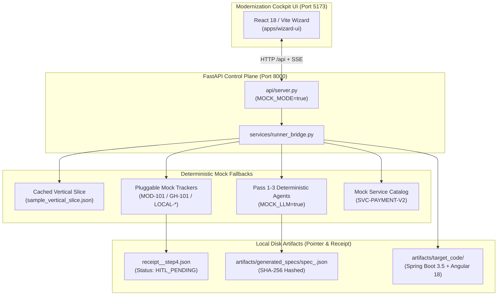
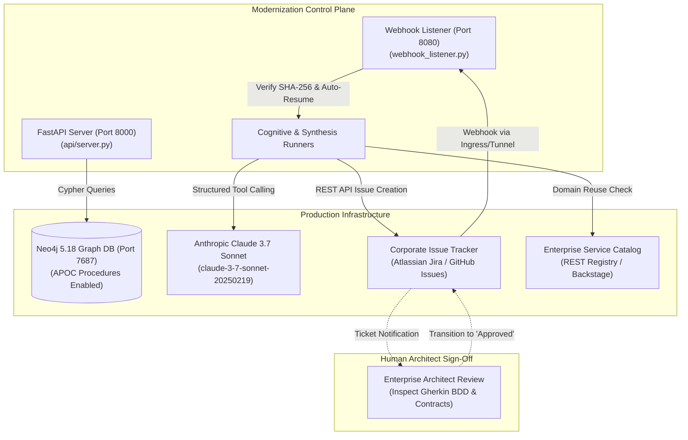

# Enterprise Legacy Modernization Factory

An autonomous, production-grade modernization pipeline that transforms legacy **Java EE 6 / JSF monoliths** into modern, cloud-native enterprise architectures (**Java 21, Spring Boot 3.5.x, Angular 18 Microfrontends with Signals, and OpenAPI 3.0.3 contracts**) following a strict, auditable **"Code-to-Spec-to-Code"** transformation paradigm.

---

## 1. System Requirements

The Modernization Factory can run either in **Mock Mode** (zero cloud accounts, fully offline, rapid local evaluation) or **Live Mode** (full enterprise infrastructure with live Neo4j, Claude 3.7 Sonnet, and real issue trackers).

| Dimension | Mock Mode Instance (Local / CI) | Live Production Instance |
| :--- | :--- | :--- |
| **Primary Use Case** | Local developer testing, UI walkthroughs, rapid test suite execution, offline sandboxing | Production modernization campaigns across multi-project legacy monoliths |
| **CPU Architecture** | 2+ cores (x86_64 or Apple Silicon ARM64) | 4+ physical cores (8+ vCPUs recommended for large AST indexing) |
| **RAM / Memory** | **4 GB minimum** (2 GB heap for Java, 1 GB for Python + UI) | **16 GB minimum** (8 GB Neo4j heap/pagecache, 4 GB Java LST, 4 GB OS/Python) |
| **Disk Space** | 1 GB free SSD storage | 20 GB+ high-speed NVMe/SSD (Neo4j graph store, LST dumps, target code repos) |
| **Operating System** | Windows 10/11, macOS 12+, or Ubuntu 20.04+ LTS | Enterprise Linux (RHEL 8/9, Ubuntu 22.04+ LTS) or Windows Server 2022 |
| **Java Runtime** | Java 17+ JDK (Eclipse Temurin / OpenJDK) + Maven 3.8+ | Java 17+ JDK (LST extractor) & Java 21+ JDK (Spring Boot 3.5 target code) + Maven 3.8+ |
| **Python Runtime** | Python 3.11+ (virtual environment recommended) | Python 3.11+ with production dependencies (`modules/pipeline-core/requirements.txt`) |
| **Node.js & Web** | Node.js 20+ LTS and npm 10+ | Node.js 20+ LTS and npm 10+ (for building/serving `apps/wizard-ui` static assets) |
| **Graph Database** | *None required* (uses cached AST slices & mock graph topology) | **Docker & Docker Compose** running Neo4j 5.18+ Enterprise or Community with APOC procedures |
| **LLM Reasoning Engine** | *None required* (deterministic mock agents simulate Passes 1–3 in <1 sec) | **Anthropic Claude 3.7 Sonnet** (`claude-3-7-sonnet-20250219`) via `ANTHROPIC_API_KEY` |
| **Issue Tracker** | *Built-in Mock Tracker* (deterministic `MOD-101`, `GH-101`, or `LOCAL-*`) | **Atlassian Jira Cloud** (`JIRA_API_TOKEN`) or **GitHub Issues** (`GITHUB_TOKEN`) with write permissions |
| **Webhook Ingress** | *None required* (simulated one-click UI approval or local file trigger) | Public ingress endpoint or tunnel (e.g. `ngrok http 8080` or reverse proxy) to receive tracker transitions |
| **Service Catalog** | *Built-in Mock Catalog* (matches sample `SVC-PAYMENT-V2`) | Enterprise Service Catalog REST API or Spotify Backstage endpoint (`CATALOG_API_URL`) |

---

## 2. Run in Mock Mode (Single-Click Launcher)

To run the complete factory—executing the **Java OpenRewrite Extractor**, launching the **FastAPI Control Plane**, and starting the **Modernization Cockpit UI** in deterministic Mock Mode—execute the unified launcher script:

### Windows (PowerShell)
```powershell
powershell -ExecutionPolicy Bypass -File .\run_mock_mode.ps1
```
*(Or simply `.\run_mock_mode.ps1` from an unrestricted PowerShell terminal).*

### Linux / macOS (Bash)
```bash
chmod +x ./scripts/run_mock_mode.sh
./scripts/run_mock_mode.sh
```

### What the Script Does Automatically:
1. **[1/3] Java Module (`modules/lst-extractor`)**:
   - Detects the OpenRewrite fat JAR (`modules/lst-extractor/target/lst-extractor-1.0.0-SNAPSHOT.jar`); builds it via Maven if not already compiled.
   - Parses the sample legacy banking monolith (`samples/legacy-banking-monolith/src/main/java`) into deep Lossless Semantic Tree (LST) JSON.
   - Emits `artifacts/raw_lst/metadata_extracted.json` (15 classes, fields, method bodies, cyclomatic branch complexity, call graphs).
2. **[2/3] Python Control Plane (`modules/pipeline-core`)**:
   - Launches FastAPI in the background on `http://localhost:8000` with `MOCK_MODE=true`, `MOCK_LLM=true`, `MOCK_JIRA=true`, and `MOCK_GITHUB=true`.
   - Verifies the health check endpoint (`/`) is operational.
3. **[3/3] UI Module (`apps/wizard-ui`)**:
   - Checks if `node_modules` are installed (runs `npm install` automatically if missing).
   - Starts the Vite React development server on `http://localhost:5173`.
4. **Graceful Teardown**:
   - Pressing **`Ctrl+C`** in the terminal gracefully terminates the Vite UI and shuts down the background FastAPI background process.

### Service Endpoints Once Running:
* 🌐 **Modernization Cockpit UI**: [http://localhost:5173](http://localhost:5173)
* ⚙️ **FastAPI Control Plane**: [http://localhost:8000](http://localhost:8000)
* 📖 **Interactive Swagger API Docs**: [http://localhost:8000/docs](http://localhost:8000/docs)
* 📄 **Extracted LST Metadata**: [`artifacts/raw_lst/metadata_extracted.json`](artifacts/raw_lst/metadata_extracted.json)

### Optional CLI Arguments:
```powershell
# Skip Java re-extraction if artifacts/raw_lst/metadata_extracted.json is already up to date:
powershell -ExecutionPolicy Bypass -File .\run_mock_mode.ps1 -SkipJava

# Specify a custom legacy source directory:
powershell -ExecutionPolicy Bypass -File .\run_mock_mode.ps1 -SourceDir "path\to\legacy\monolith"

# Customize ports:
powershell -ExecutionPolicy Bypass -File .\run_mock_mode.ps1 -BackendPort 8000 -UiPort 5173
```

---

## 3. System Overview & Core Invariants

The Modernization Factory is governed by strict architectural guardrails:
* **Code-to-Spec-to-Code**: Direct code-to-code translation is strictly forbidden. Legacy code is first parsed into Lossless Semantic Trees (LST), stored in a Graph Knowledge Base, extracted via GraphRAG, abstracted into technology-agnostic Gherkin BDD specifications, and only synthesized into modern target code after human architectural sign-off.
* **Pointer & Receipt Pattern**: Large AST dumps, call graphs, and code slices never travel in memory. Every pipeline transition emits an immutable, cryptographically hashed (`SHA-256`) `StepHandoffReceipt` to disk.
* **Human-in-the-Loop (HITL) Gate**: Execution pauses in state `HITL_PENDING` at Step 4. Step 5 (Target Synthesis) strictly requires verified human approval metadata.
* **Dual Operational Surfaces**:
  1. **Modernization Cockpit UI**: An interactive React 18 / Vite / TypeScript web application (`apps/wizard-ui`) with Cytoscape topology visualization and dual-pane Monaco code inspection.
  2. **Headless / CI CLI Pipeline**: Standalone Python runners, shell scripts, and an automated FastAPI webhook listener (`webhook_listener.py`) for zero-touch CI/CD resume.
* **Pluggable Issue Tracking**: Built-in support for **Atlassian Jira**, **GitHub Issues**, and **Local Files (JSON/Markdown)**, extensible to custom enterprise trackers (Azure DevOps, GitLab, Linear) via runtime factory registration.

---

## 4. Architecture in Mock Mode (Offline / Sandbox)

Mock Mode allows developers and CI/CD pipelines to run, test, and iterate on the entire 5-step modernization lifecycle locally without external API keys, cloud credentials, or live databases.



### Characteristics of Mock Mode:
1. **Zero External Dependencies**: Does not require Anthropic API credits, Neo4j container startup, or internet access.
2. **Deterministic Extraction**: Cognitive agents (`DecompilerAgent`, `BusinessAbstractorAgent`, `SpecFormatterAgent`) parse slices into predictable business rules (e.g. the `$50,000.00` daily transfer ceiling and validation invariants).
3. **Mock Issue Creation**: Emits deterministic tracking IDs (`MOD-101` for Jira, `GH-101` for GitHub, or `LOCAL-<short_id>` for local files).
4. **Mock Catalog Matcher**: Emulates an Enterprise Service Catalog response discovering `SVC-PAYMENT-V2` for domain API reuse.
5. **Instant UI Walkthrough**: The Modernization Cockpit UI runs out-of-the-box with pre-populated graphs, Monaco comparisons, and simulated one-click approvals.

---

## 5. Architecture in Live Mode (Production)

In Live Mode, the Modernization Factory connects to enterprise infrastructure, live graph storage, real LLM reasoning engines, and corporate issue trackers.



### Characteristics of Live Mode:
1. **OpenRewrite AST Ingestion**: Java 17 parses actual Java EE monolith source directories, capturing class hierarchies, annotations (`@ManagedBean`, `@EJB`, `@Stateless`), method bodies, exceptions thrown, and call graphs.
2. **Neo4j Knowledge Graph**: Batch ingests millions of AST nodes (`:Class`, `:Method`, `:Field`, `:Endpoint`) with Cypher relationships (`:CALLS`, `:INJECTS`, `:PERSISTS`).
3. **GraphRAG Slicing**: Dynamically extracts vertical execution paths (Presentation → Domain Service → Mainframe Gateway / DB), enforcing the strict `MAX_SLICE_TOKENS = 6,000` context boundary.
4. **Cognitive LLM Chain**: Calls Anthropic Claude 3.7 Sonnet using strict JSON Schema tool calling across three isolated passes:
   - **Pass 1 (Decompiler)**: Strips framework boilerplate (`FacesContext`, container transactions).
   - **Pass 2 (Business Abstractor)**: Extracts technology-agnostic business rules and thresholds.
   - **Pass 3 (Spec Formatter)**: Synthesizes Gherkin BDD scenarios and OpenAPI contracts with full legacy traceability.
5. **Issue Tracker Publication**: Posts stories to live Jira (`/rest/api/2/issue`) with Jira Wiki markup or GitHub Issues with GFM tables and alert callouts.
6. **Cryptographic Anti-Tamper Verification**: Webhook listener re-hashes the on-disk specification file; any manual tampering rejects the transition (`REJECT_TAMPERED`).

---

## 6. Modernization Cockpit UI Tour

The web cockpit (`apps/wizard-ui`) is a 5-step guided wizard for enterprise modernization teams. Below is the side-by-side comparison of **Mock Mode** vs. **Live Mode** behavior across each screen:

| Step / Screen | Component File | Capabilities & Overview | Mock Mode Behavior | Live Production Behavior |
| :--- | :--- | :--- | :--- | :--- |
| **Step 1: Source Ingestion** | [`SourceIngestScreen.tsx`](apps/wizard-ui/src/screens/SourceIngestScreen.tsx) | Enter legacy source directory paths, trigger OpenRewrite LST extraction, and monitor ingestion progress and class counts. | Loads pre-extracted class records and AST summary metrics from `artifacts/raw_lst/metadata_extracted.json` without executing the Maven/Java build process. Enables instantaneous offline walkthrough. | Spawns the live OpenRewrite Java 17+ parser (`modules/lst-extractor`) against the specified source directory, parses deep type attribution and method bodies, builds `metadata_extracted.json`, and triggers real-time batch ingestion into the live Neo4j database. |
| **Step 2: Topology & Slicing** | [`TopologyScreen.tsx`](apps/wizard-ui/src/screens/TopologyScreen.tsx)<br/>[`CytoscapeGraph.tsx`](apps/wizard-ui/src/components/CytoscapeGraph.tsx) | Interactive dependency graph powered by Cytoscape.js. Explore classes, EJBs, and gateways; select entry points and extract GraphRAG execution slices. | Loads a pre-defined 5-node graph topology (`TransferManagedBean` → `TransferProcessingService` → `CicsMainframeGateway` / `AccountRepository`) and serves the cached canonical vertical slice (`sample_vertical_slice.json`) without requiring a live Neo4j database container. | Executes real-time Cypher queries over the live Neo4j database (`bolt://localhost:7687`), dynamically rendering the full enterprise graph. Slicing dynamically pulls isolated execution paths across presentation, service, and database boundaries while actively enforcing the `MAX_SLICE_TOKENS = 6,000` limit. |
| **Step 3: Telemetry & Tracing** | [`TelemetryScreen.tsx`](apps/wizard-ui/src/screens/TelemetryScreen.tsx) | Real-time monitoring of LLM cognitive agent token usage, execution latency, and pass-by-pass status indicators. | Deterministically simulates the 3-pass cognitive execution in <1 second with fixed token counts (~1,450 tokens) and pre-recorded rules, requiring no Anthropic API key or cloud connection. | Streams real-time Server-Sent Events (SSE) as Anthropic Claude 3.7 Sonnet processes the vertical slice across Pass 1 (Decompiler), Pass 2 (Business Rules), and Pass 3 (Gherkin BDD). Displays actual token consumption, prompt/completion latency, and computes the specification SHA-256 digest on the fly. |
| **Step 4: HITL Review & Gate** | [`HitlReviewScreen.tsx`](apps/wizard-ui/src/screens/HitlReviewScreen.tsx)<br/>[`MonacoViewer.tsx`](apps/wizard-ui/src/components/MonacoViewer.tsx) | Side-by-side Monaco editor comparing legacy Java source code with synthesized Gherkin BDD specs and OpenAPI contracts. Clicking scenarios highlights legacy methods. Includes one-click approval and issue tracker synchronization. | Displays pre-computed specifications with mock ticket identifier (`MOD-101`, `GH-101`, or `LOCAL-*`). Clicking "Approve & Sign-Off" updates the local receipt to `SUCCESS` on disk without external network calls. | Posts the generated specification directly to live Atlassian Jira Cloud (`/rest/api/2/issue`) or GitHub Issues API with real URLs. Cross-references legacy lines in the Monaco pane. Human architects can approve directly in Jira/GitHub or via the UI button, validated against the on-disk receipt with cryptographic SHA-256 anti-tamper verification. |
| **Step 5: Target Synthesis** | [`SynthesisScreen.tsx`](apps/wizard-ui/src/screens/SynthesisScreen.tsx) | Code browser displaying generated Spring Boot 3.5.x Java 21 classes, Angular 18 microfrontend components with Signals, and JUnit 5 tests. Allows direct export or repository push. | Generates target code using deterministic mock templates based on mock catalog match `SVC-PAYMENT-V2`. Demonstrates generated architecture without external catalog queries. | Interrogates the live Enterprise Service Catalog registry to verify existing domain API reuse, invokes the synthesizer agent, generates net-new Java 21 / Spring Boot 3.5.x services with Jakarta validations, builds standalone Angular 18 components with Signals (`signal()`, `computed()`), and writes 8 production assets to `artifacts/target_code/` tagged with the live issue tracking ID. |

---

## 7. Configuration & Environment Matrix

Configure these values via `.env` in the repository root or via environment variables:

```ini
# =============================================================================
# Modernization Factory Environment Configuration
# =============================================================================

# --- Operational Toggles ---
MOCK_MODE=true                # Set to false for live production operation
MOCK_LLM=true                 # Set to false to invoke Anthropic Claude 3.7
MOCK_JIRA=true                # Set to false to create real Jira Cloud stories
MOCK_GITHUB=true              # Set to false to create real GitHub issues

# --- LLM Provider Credentials ---
ANTHROPIC_API_KEY=sk-ant-...  # Required when MOCK_LLM=false

# --- Neo4j Graph Database ---
NEO4J_URI=bolt://localhost:7687
NEO4J_USER=neo4j
NEO4J_PASSWORD=modernization_secret

# --- Issue Tracker Strategy ('jira', 'github', or 'local') ---
ISSUE_TRACKER=jira

# If using Atlassian Jira:
JIRA_BASE_URL=https://your-domain.atlassian.net
JIRA_USER_EMAIL=architect-bot@enterprise.com
JIRA_API_TOKEN=your_atlassian_api_token
JIRA_PROJECT_KEY=MOD

# If using GitHub Issues:
GITHUB_TOKEN=ghp_...
GITHUB_REPOSITORY=owner/repository-name
GITHUB_API_URL=https://api.github.com

# If using Local File Tracker:
LOCAL_ISSUES_DIR=artifacts/issues

# --- Enterprise Service Catalog ---
CATALOG_API_URL=https://catalog.internal.enterprise.com/api/v1
```

---

## 8. Deep-Dive Execution Runbook

### Prerequisites
* **Java 17+ JDK** (Eclipse Temurin / OpenJDK) and **Apache Maven 3.8+**
* **Python 3.11+** with virtual environment
* **Node.js 20+** and **npm** (for UI)
* **Docker & Docker Compose** (for Neo4j in live mode)

---

### Running in Mock Mode (Local Evaluation)

#### Option 1: Unified 3-Module Launcher (Recommended)
Runs Java OpenRewrite LST extraction, launches FastAPI control plane, and starts Vite React Cockpit UI together:
```powershell
powershell -ExecutionPolicy Bypass -File .\run_mock_mode.ps1
```
*(See [Section 2: Run in Mock Mode](#2-run-in-mock-mode-single-click-launcher) for full details, Bash script, and CLI flags).*

#### Option 2: Cockpit Web UI + Backend Only
Launches the FastAPI backend and Vite React UI simultaneously without re-extracting Java source code:

**On Windows (PowerShell)**:
```powershell
powershell -ExecutionPolicy Bypass -File scripts\run_modernization_cockpit.ps1
```

**On Linux / macOS (Bash)**:
```bash
./scripts/run_modernization_cockpit.sh
```
* **Cockpit UI**: `http://localhost:5173`
* **API Swagger Docs**: `http://localhost:8000/docs`

#### Option 3: Headless End-to-End Pipeline in Mock Mode
Runs Steps 1 through 5, simulates webhook approval, and generates target code in the terminal:
```powershell
powershell -ExecutionPolicy Bypass -File scripts\run_full_pipeline.ps1
```

---

### Running in Live Production Mode

#### Step 1: Start Live Infrastructure
Start the pre-configured Neo4j 5.18 container:
```bash
docker-compose up -d neo4j
```
Verify Neo4j Browser at `http://localhost:7474` (`neo4j` / `modernization_secret`).

If using Jira Cloud or GitHub.com, start a public tunnel to receive webhook transitions:
```bash
ngrok http 8080
```
Configure your Jira webhook to `https://<tunnel-id>.ngrok-free.app/webhooks/jira/transition`.

#### Step 2: Configure Live Credentials
Ensure `.env` contains:
```ini
MOCK_MODE=false
MOCK_LLM=false
MOCK_JIRA=false
ANTHROPIC_API_KEY=sk-ant-api03-...
JIRA_BASE_URL=https://enterprise.atlassian.net
JIRA_API_TOKEN=your_token
```

---

### Running the Java LST Extractor (`modules/lst-extractor`)

The **LST Extractor** is a high-performance Java 17+ CLI tool built on top of OpenRewrite (`rewrite-java`), Jackson, and Picocli. It parses Java EE 6 / JSF source trees into deep Lossless Semantic Trees (LST) with type attribution, extracting classes, annotations, fields, method bodies, cyclomatic branch counts, thrown exceptions, and invocation call graphs.

#### 1. Build the Module
From the project root, compile and package the executable fat JAR with dependencies:
```bash
mvn clean package -f modules/lst-extractor/pom.xml
```
* Generates: `modules/lst-extractor/target/lst-extractor-1.0.0-SNAPSHOT.jar`

#### 2. Run via Executable Fat JAR (Recommended)
```bash
java -jar modules/lst-extractor/target/lst-extractor-1.0.0-SNAPSHOT.jar \
  --source-dir samples/legacy-banking-monolith/src/main/java \
  --output artifacts/raw_lst/metadata_extracted.json
```

#### 3. Run Directly via Maven `exec:java` (No JAR required)
```bash
mvn exec:java -f modules/lst-extractor/pom.xml \
  -Dexec.mainClass="com.enterprise.modernization.rewrite.ExtractorCli" \
  -Dexec.args="--source-dir samples/legacy-banking-monolith/src/main/java --output artifacts/raw_lst/metadata_extracted.json"
```

#### 4. CLI Arguments Reference

| Option | Shorthand | Description | Default |
| :--- | :--- | :--- | :--- |
| `--source-dir` | `-s` | Root directory containing the legacy Java source files to analyze | `./src` |
| `--output` | `-o` | Output file path for the extracted JSON payload | `metadata_extracted.json` |
| `--help` | `-h` | Display usage help and available options | — |
| `--version` | `-V` | Print version information | `1.0.0` |

#### 5. Graceful Degradation & Fault Tolerance
* **Missing Classpath JARs**: In legacy environments, complete compile-time classpaths are rarely available. The extractor utilizes OpenRewrite's `JavaParser` with TypeTables and synthetic stubs; unresolved types are flagged and fall back to raw AST text representations rather than crashing.
* **Corrupted Source Files**: Any source files that cannot be parsed are logged as `WARN`/`ERROR` and gracefully skipped, allowing the rest of the monolith to be indexed.

---

### Running the Complete Pipeline in Live Mode

#### Step 3: Ingest into Neo4j & Extract GraphRAG Vertical Slice
```powershell
$env:PYTHONPATH="modules/pipeline-core"

# 1. Batch ingest extracted LST into Neo4j
python modules/pipeline-core/pipeline_core/graph/ingest_graph.py `
  --input artifacts/raw_lst/metadata_extracted.json

# 2. Extract isolated vertical slice for targeted entry component
python modules/pipeline-core/pipeline_core/graph/queries.py `
  --entry "com.legacy.banking.web.TransferManagedBean"
```

#### Step 4: Launch Modernization Cockpit in Live Mode

**Terminal 1 — FastAPI Control Plane**:
```powershell
$env:PYTHONPATH="modules/pipeline-core"
$env:MOCK_MODE="false"
$env:MOCK_LLM="false"
$env:MOCK_JIRA="false"
python -m uvicorn api.server:app --host 0.0.0.0 --port 8000 --reload
```

**Terminal 2 — React Wizard UI**:
```powershell
cd apps\wizard-ui
npm install
npm run dev -- --host 0.0.0.0 --port 5173
```
Open `http://localhost:5173` and follow the 5-step wizard through Source Ingest, Topology Slicing, Telemetry, Monaco HITL Sign-off, and Target Code Synthesis.

#### Step 5: Standalone CI/CD Execution in Live Mode
```powershell
$env:PYTHONPATH="modules/pipeline-core"
$env:MOCK_LLM="false"
$env:MOCK_JIRA="false"

# 1. Run Step 3 & 4 (publishes real story to Jira, pauses in HITL_PENDING)
python -m pipeline_core.workflows.cognitive_runner --tracker jira

# 2. Start listener to auto-synthesize Step 5 once the ticket is marked 'Approved'
python -m pipeline_core.integrations.webhook_listener --auto-synthesize
```

---

## 9. Automated Test Suite

The pipeline includes a comprehensive 84-test verification suite covering LST extraction, GraphRAG Cypher retrieval, 3-pass cognitive agents, pluggable issue trackers, webhook anti-tamper logic, target code synthesis, 4-layer target architecture harvesting, Step 5.5 ArchUnit conformance gating, and the FastAPI control plane:

```powershell
$env:PYTHONPATH="modules/pipeline-core"
python -m pytest modules/pipeline-core/tests/ -v
```

Expected output:
```text
============================= 84 passed in 8.40s ==============================
```

To run the dedicated Architecture Profile Harvesting demonstration and tests:
```powershell
powershell -ExecutionPolicy Bypass -File scripts\test_architecture_harvesting.ps1
```
*(Or on Linux/macOS: `./scripts/test_architecture_harvesting.sh`)*

---

## 10. Repository Layout

```text
modernization/
├── run_mock_mode.ps1               # Unified Mock Mode Launcher (Java + FastAPI + Vite UI)
├── apps/
│   └── wizard-ui/                  # React 18 + Vite + Tailwind + Cytoscape Cockpit UI
│       ├── src/
│       │   ├── components/         # MonacoViewer, CytoscapeGraph, WizardLayout
│       │   ├── screens/            # 5-step screens (Source, Topology, Telemetry, HITL, Synthesis)
│       │   └── store/              # Zustand global state management
│       └── package.json
├── modules/
│   ├── lst-extractor/              # Java 17+ OpenRewrite Lossless Semantic Tree parser
│   │   ├── pom.xml
│   │   └── src/main/java/          # ExtractorCli, LegacyMetadataExtractor, ClassRecord
│   ├── pipeline-core/              # Python 3.11+ Core Orchestration & API Plane
│   │   ├── api/                    # FastAPI Server (routers: source, graph, hitl, synthesis, architecture)
│   │   │   └── routers/architecture.py # /api/architecture/harvest-reference, /profiles, /select-active
│   │   ├── pipeline_core/
│   │   │   ├── agents/             # Decompiler, BusinessAbstractor, SpecFormatter, Synthesizer
│   │   │   ├── architecture/       # 4-Layer Harvester, ArchUnit Templates, Profile Registry
│   │   │   │   ├── provider_base.py          # TargetArchitectureProvider ABC
│   │   │   │   ├── reference_repo_provider.py # 4-layer reference microservice inspector
│   │   │   │   ├── archunit_templates.py      # Standard ArchUnit rules & generator
│   │   │   │   └── registry.py               # Persistent profile storage & active pointer
│   │   │   ├── graph/              # Neo4j batch ingestion & Cypher GraphRAG queries
│   │   │   ├── integrations/       # Webhook listener & trackers (Jira, GitHub, Local)
│   │   │   ├── schemas/            # Pydantic v2 data contracts (handoff, spec, webhook, architecture)
│   │   │   └── workflows/          # CognitiveRunner, TargetSynthesisRunner (Step 5.5 ArchUnit Gate)
│   │   └── tests/                  # Pytest test suite (84 tests)
│   └── target-generators/          # Code generation templates (Spring Boot 3.5, Angular 18)
├── samples/
│   ├── legacy-banking-monolith/    # Sample Java EE 6 / JSF banking application
│   └── reference-spring-boot-service/ # Production reference service (Spring Boot 3.5, Java 21, ArchUnit)
├── scripts/
│   ├── test_architecture_harvesting.ps1/.sh # Demo & test runner for Architecture Harvester
│   ├── run_mock_mode.ps1/.sh       # Wrapper for root run_mock_mode.ps1
│   ├── run_modernization_cockpit.ps1/.sh  # Launcher for Cockpit UI + FastAPI backend
│   ├── run_full_pipeline.ps1/.sh          # End-to-end headless pipeline orchestrator
│   ├── run_step1_and_step2.ps1/.sh        # LST extraction & Neo4j ingestion
│   ├── run_step3_and_step4.ps1/.sh        # Cognitive chain & HITL publication
│   └── run_step5_target_synthesis.ps1/.sh # Target enterprise code synthesis
├── docker-compose.yml              # Local Neo4j 5.18 database setup
└── README.md                       # Project documentation
```
